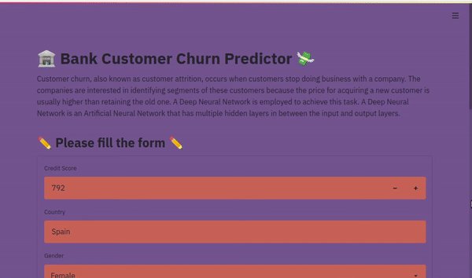

# Bank Customer Churn Predictor

## Customer Churn

Customer churn, also known as customer attrition, occurs when customers stop doing business with a company. The companies are interested in identifying segments of these customers because the price for acquiring a new customer is usually higher than retaining the old one. For example, if Netflix knew a segment of customers who were at risk of churning they could proactively engage them with special offers instead of simply losing them.

## Customer Churn in Finance

Customer churn in an important factor in financial services. We have identified that the industry’s performance metric is the amount of customers they have. As such, a system that could potentially identify customers that are most likely to stop doing business with the bank would be very beneficial. Identifying such customers would allow banks to put in efforts towards specific customer retention and could help them improve their services in the long run.

<p align="center">
  
  
</p>

## Deep Neural Network

A Deep Neural Network is an Artificial Neural Network that has multiple hidden layers in between the input and output layers. ANNs are computationally designed to simulate the human brain. DNNs have been applied in fields including Computer Vision, Natural Language Processing, Speech Processing, and more.


<p align="center">
  
</p>


## Install Packages

Install required libraries using the following command:
```bash
$ pip install -r requirements.txt
```


## Files

- `Churn_Predictor.ipynb`: Notebook to build Bank Customer Churn Predictor
- `/data`: Dataset
- `/models`: Pre-trained model for inference
- `/encoders`: Encoders
- `/scalers`: Scaler
- `/assets`: All images displayed on this README.md
- `model.py`: DNN model
- `predictor.py`: Churn predictor
- `report.pdf`: Project report
- `run.py`: Streamlit app


## Train, Evaluate, and Test

Check out the notebook [Churn_Predictor.ipynb](Churn_Predictor.ipynb) to train, evaluate, and test your own model on custom datasets.


## Run Streamlit App

Use the following command to run Streamlit App:
```bash
$ streamlit run run.py

  You can now view your Streamlit app in your browser.

  Local URL: http://localhost:8501
  Network URL: http://192.168.1.4:8501

```

Check out the GIF below for a demo!


